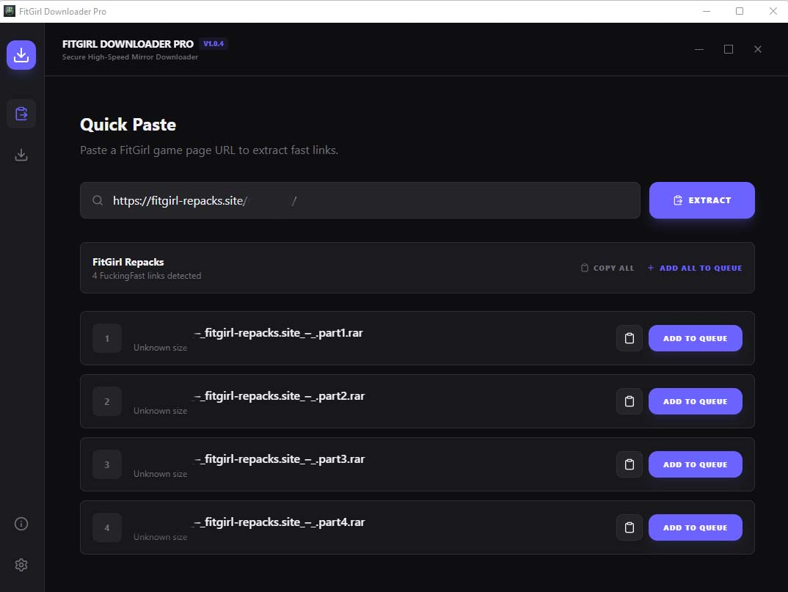

# FitGirl Downloader Pro (FDP) 🚀

FitGirl Downloader Pro is a high-performance, open-source download manager specifically designed to streamline the process of downloading game repacks from high-speed mirror providers. Built with **Tauri**, **React**, and **Rust**, it offers a native, lightweight, and blazing-fast experience.




---

## ✨ Features

- **High-Speed Link Resolution**: Automatically extracts direct CDN links from mirror sites (FuckingFast).
- **Native Performance**: Built on a Rust core for minimal resource usage and maximum throughput.
- **Smart Queue Management**: Sequential downloading with automatic pause/resume support.
- **Visual Excellence**: Premium Dark/OLED UI with dynamic accent colors and modern animations.
- **Real-time Monitoring**: Live speed tracking, ETA calculation, and progress updates.
- **Desktop Integration**: Native Windows notifications and "Open Folder" explorer integration.
- **Portable Mode**: No installation required—run it from anywhere.

---

## 🛠️ Technology Stack

- **Frontend**: React 19, TypeScript, Tailwind CSS, Lucide Icons
- **Backend**: Rust, Tauri 1.x, Reqwest, Tokio
- **Animations**: Motion (Framer Motion)
- **Utilities**: Dnd-kit (for queue reordering), Cheerio/Scraper (for link extraction)

---

## 🚀 Getting Started

### Prerequisites
- [Node.js](https://nodejs.org/) (v18+)
- [Rust](https://rustup.rs/) (latest stable)
- [Tauri Dependencies](https://tauri.app/v1/guides/getting-started/prerequisites)

### Installation
1. Clone the repository:
   ```bash
   git clone https://github.com/yourusername/fitgirl-downloader-pro.git
   ```
2. Install dependencies:
   ```bash
   npm install
   ```
3. Run in development mode:
   ```bash
   npm run tauri dev
   ```

### Building for Production
To create a standalone portable executable:
```bash
npm run tauri build
```
The output will be located in `src-tauri/target/release/FitGirl Downloader Pro.exe`.

---

## 📂 Project Structure

- `src/`: React frontend application.
- `src-tauri/`: Rust backend, configuration, and build logic.
- `server.ts`: Mock API server for development testing.
- `.gitignore`: Configured to exclude heavy build artifacts.

---

## 📜 Disclaimer

**FitGirl Downloader Pro** is a link resolution and download management utility. We do not host, store, or distribute any game files. This tool is intended for personal use in managing downloads from legal sources. Users are responsible for complying with their local copyright laws and regulations.

---

## 🤝 Support & Contribution

If you find this project helpful, consider leaving a ⭐ on GitHub! For bugs and feature requests, please open an issue.

**Developer**: [Rubayet Alam](https://github.com/Rubayet123)
